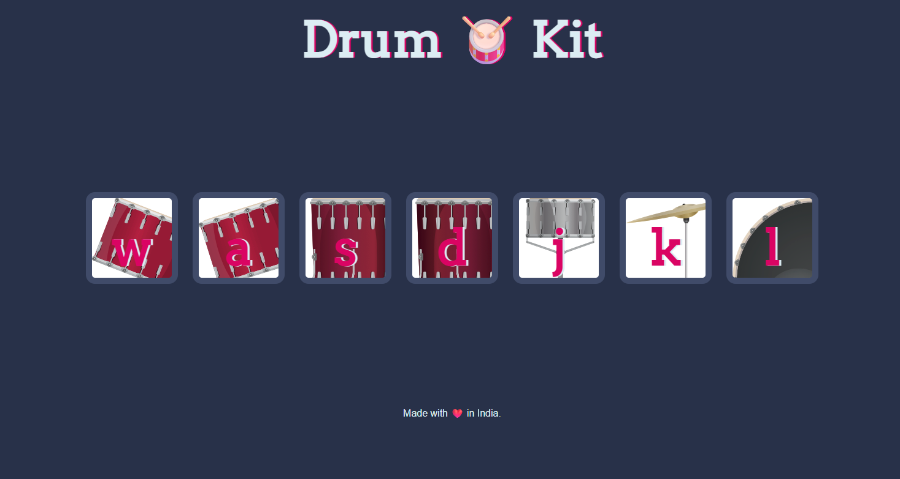

# 🥁 Drum Kit

An interactive **Drum Kit Web App** built with **HTML, CSS, and JavaScript**.  
Play different drum sounds by pressing keys (`w`, `a`, `s`, `d`, `j`, `k`, `l`) on your keyboard or by clicking on the drum icons.  

---

## 🚀 Features
- Play drum sounds using **keyboard keys**.
- Clickable **drum images** for sound effects.
- Simple, clean, and responsive **UI design**.
- Fun way to learn **DOM manipulation** and **event handling** in JavaScript.

---

## 📂 Project Structure
```
📦 Drum-Kit
┣ 📂 images # Drum images
┣ 📂 sounds # Drum sound files
┣ 📜 index.html # Main HTML file
┣ 📜 index.js # JavaScript logic
┣ 📜 styles.css # Styling file
┗ 📜 README.md # Project documentation
```


---

## 🖥️ Demo

You can see the project live at: **[Drum Kit Live Demo](https://shrijan18.github.io/Basic-Drum-Kit/)**




---

## 🎮 How to Play
1. Open `index.html` in your browser.
2. Press the following keys to play:
   - `w` → Drum 1  
   - `a` → Drum 2  
   - `s` → Drum 3  
   - `d` → Drum 4  
   - `j` → Drum 5  
   - `k` → Drum 6  
   - `l` → Drum 7  
3. Or click directly on the drum images.

---

## ⚙️ Technologies Used
- **HTML5**
- **CSS3**
- **JavaScript (ES6)**

---

## 📌 Future Enhancements
- Add more drum sounds.
- Add background music toggle.
- Record & playback feature.

---

## ❤️ Made with Love
Made with ❤️ in India.  

---

## 📜 License
This project is open-source and available under the [MIT License](LICENSE).
